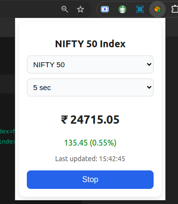
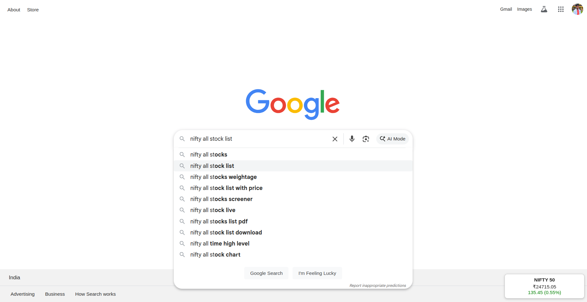

# 📈 NIFTY Index Chrome Extension

A Chrome Extension that shows live data for NSE indices such as **NIFTY 50**, **BANKNIFTY**, and more.  
It fetches live quotes from [NSE India](https://www.nseindia.com) and displays them in a clean popup card with a dropdown for index selection and refresh interval.

---

## 🚀 Features
- Live fetch of NIFTY indices (NIFTY 50, BANKNIFTY, etc.)
- Configurable **refresh intervals** (5s, 10s, 15s)
- Simple and clean **UI card**
- Price, change %, and last updated time
- Works in popup and can inject into pages (via `content.js` widget)

---

## 📂 Project Structure

nifty-extension/

├── manifest.json # Chrome extension manifest (MV3)

├── background.js # Background service worker (fetching live data)

├── popup.html # Popup UI

├── popup.js # Popup logic

├── styles.css # Popup styling

├── content.js # Optional: injects widget into websites

├── icons/ # Extension icons (16, 48, 128 px)

└── README.md # Documentation

---

## 🛠 Installation
1. Clone this repository or download the ZIP.
2. Open Chrome and go to `chrome://extensions/`.
3. Enable **Developer mode** (top-right toggle).
4. Click **Load unpacked** and select the extension folder.
5. The extension will appear in your Chrome toolbar.

---

## ⚙️ Usage
1. Click on the extension icon in the toolbar.
2. In the popup:
   - Select the **Index** (e.g., NIFTY 50, BANKNIFTY).
   - Select the **Refresh Time** (5s, 10s, 15s).
   - Click **Start** to begin fetching data.
3. The card will update automatically with live price, change, and timestamp.
4. Click **Stop** to pause updates.

---

## 📡 Data Source
All data is fetched from the **official NSE India API**:  

Example:
- `NIFTY 50` → `https://www.nseindia.com/api/equity-stockIndices?index=NIFTY%2050`
- `NIFTY BANK` → `https://www.nseindia.com/api/equity-stockIndices?index=NIFTY%20BANK`
---

## 🖼 Icons
Add icons in the `/icons` folder:
- `icon16.png`
- `icon48.png`
- `icon128.png`

You can create them using any icon generator (recommend using a simple stock/graph icon).

---

## ⚠️ Notes
- The NSE API sometimes blocks requests if too frequent. Adjust refresh time to avoid being rate-limited.
- Works best with intervals ≥ 5 seconds.
- Ensure your system clock is accurate for correct timestamps.

---

## 📌 To-Do
- Add more indices (Midcap, IT, etc.)
- Add charts for price history
- Add notifications for large movements

---

👨‍💻 Developed for educational and personal tracking of NIFTY indices.
---
## SCREEN SHORT 

